# Nama Aplikasi App - Flutter Application

<div align="center">
<url>
  
  </div>
<div align="center">
Institut Teknologi dan Bisnis Bina Sarana Global <br>
FAKULTAS TEKNOLOGI INFORMASI & KOMUNIKASI 
<br>
https://global.ac.id/
  </div>

## Project UAS

- Mata Kuliah : Aplikasi Mobile
- Kelas : TI SE P2 2023
- Semester : GANJIL
- Tahun Akademik: 2025 - 2026

## About The Project

PawRes adalah aplikasi mobile modern yang dikembangkan menggunakan Flutter untuk membantu Hewan terbuang dan terlantar untuk ditemukan oleh komunitas pecinta hewan. aplikasi ini menyediakan antarmuka yang intuitif, fitur sinkronisasi cloud menggunakan firebase authentication , firebase store dan Supabase

### Key Features

- **Modern UI/UX Design** - Antarmuka yang clean dan user-friendly
- **Push Notifications** - Reminder untuk notifikasi hewan yang sudah di upload
- **Cloud Sync** - Sinkronisasi otomatis dengan Firebase
- **Filter Otomatis** - Memfilter hewan sesuai tipe yaitu anjing dan kucing
- **Dashboard** - Menampilkan Hewan yang membutuhkan pertolongan
- **Activity** - Menampilkan Laporan hewa yang dibuat oleh user
- **Explore** - Fitur pencari laporan hewan
  **Profile** - Menampilkan profile user

## 📸 Application Screenshots

### 🌊 Splash Screen Sequence

|                         Splash 1                         |                         Splash 2                         |                       Splash 3                       |
| :------------------------------------------------------: | :------------------------------------------------------: | :--------------------------------------------------: |
| 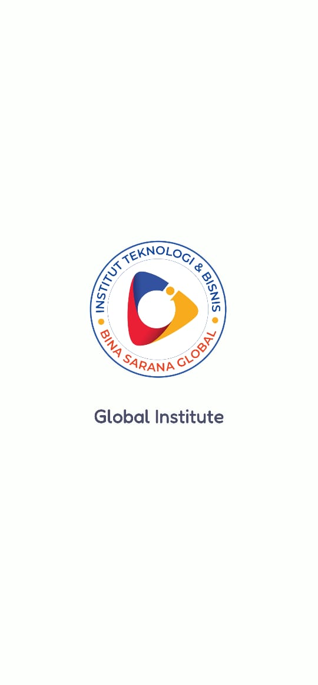 | 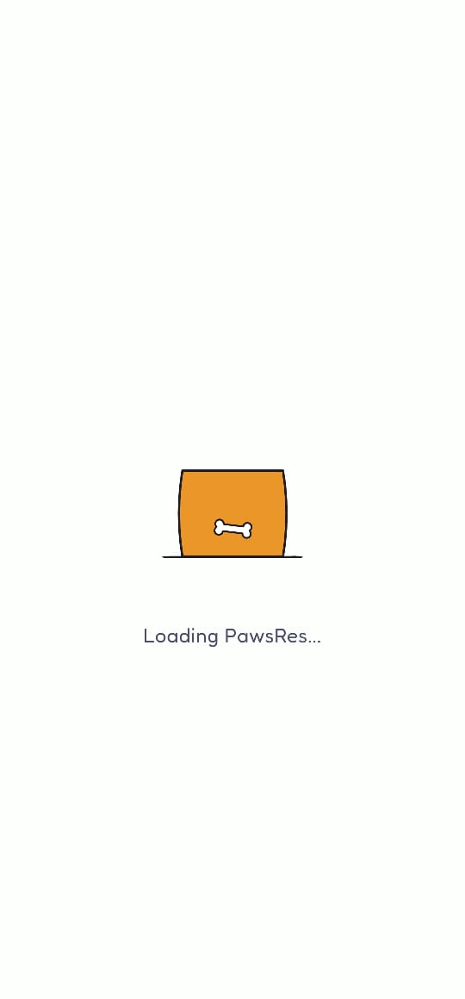 | 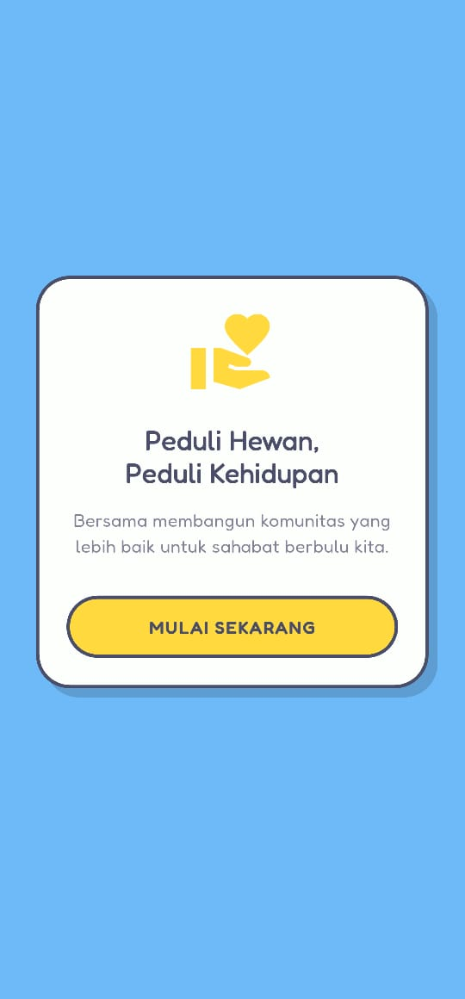 |

### 🔐 Authentication & Navigation

|                    Login Page                     |                    Register Page                     |                 Navigation Drawer                  |
| :-----------------------------------------------: | :--------------------------------------------------: | :------------------------------------------------: |
| 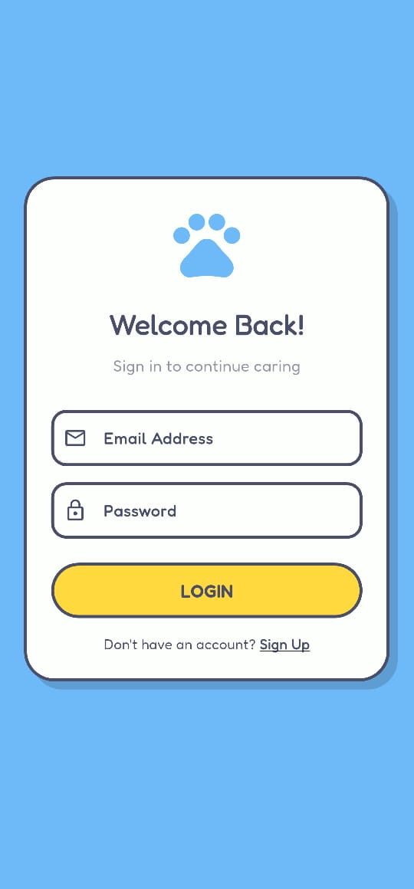 | 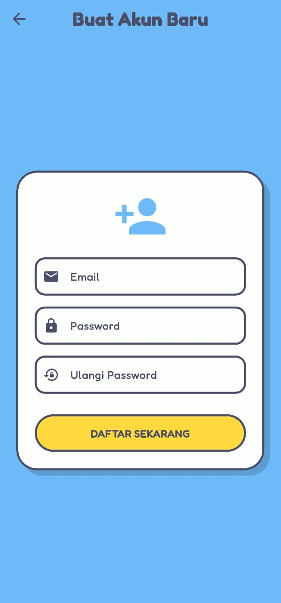 | 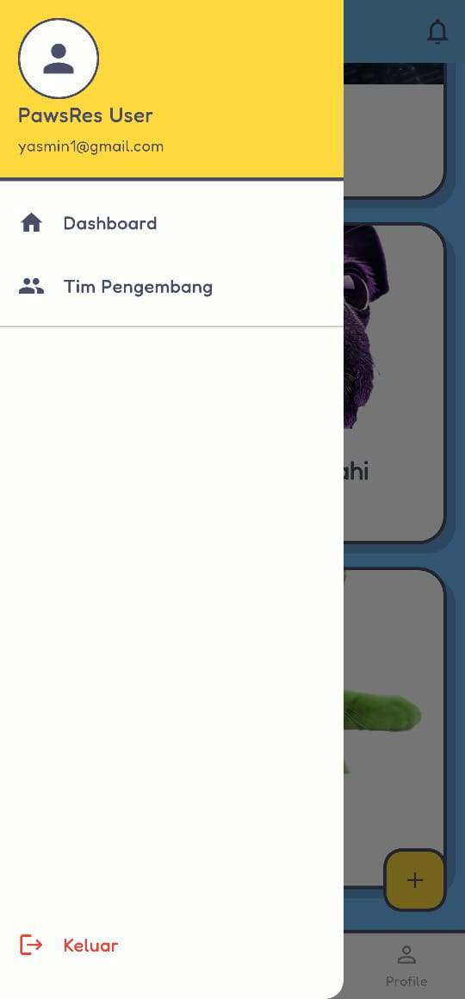 |

### 📱 Main Features & Reports

|                       Dashboard                       |                    Explore Page                     |                Add Report (Form)                 |
| :---------------------------------------------------: | :-------------------------------------------------: | :----------------------------------------------: |
| 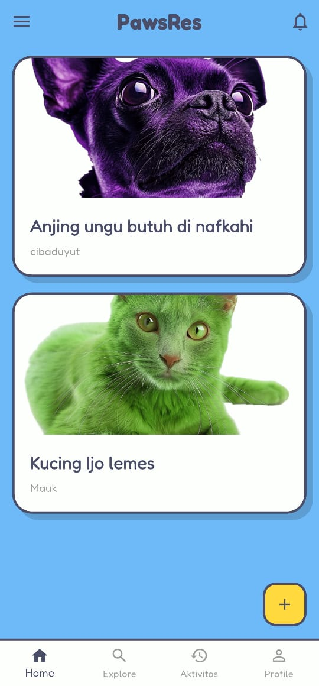 |  | 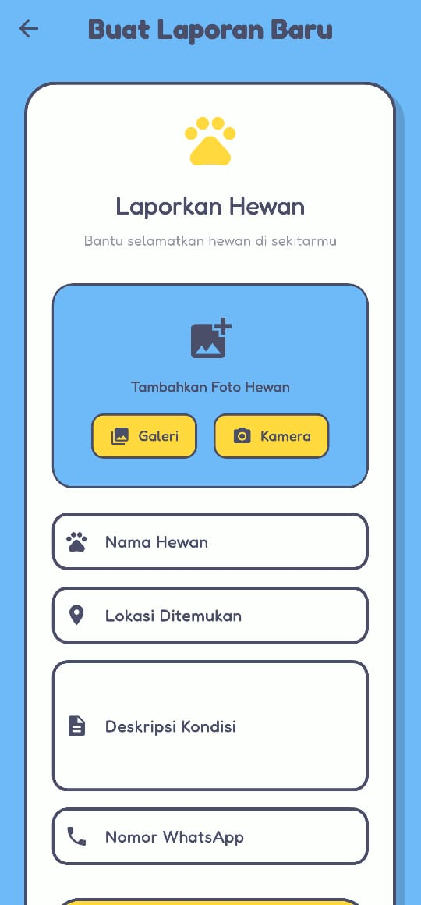 |

### 👤 User Activity & Notifications

|                   User Profile                    |                    Activity Details                     |                  Notification Center                   |
| :-----------------------------------------------: | :-----------------------------------------------------: | :----------------------------------------------------: |
| 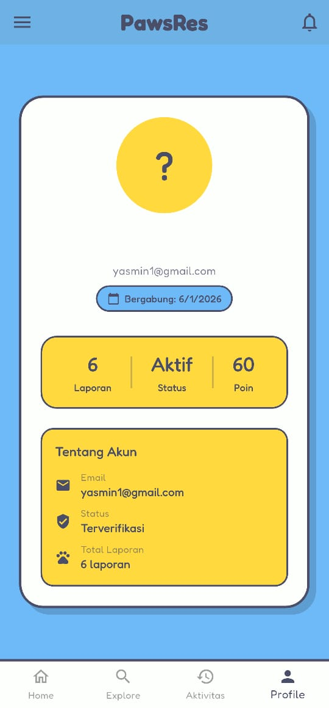 | 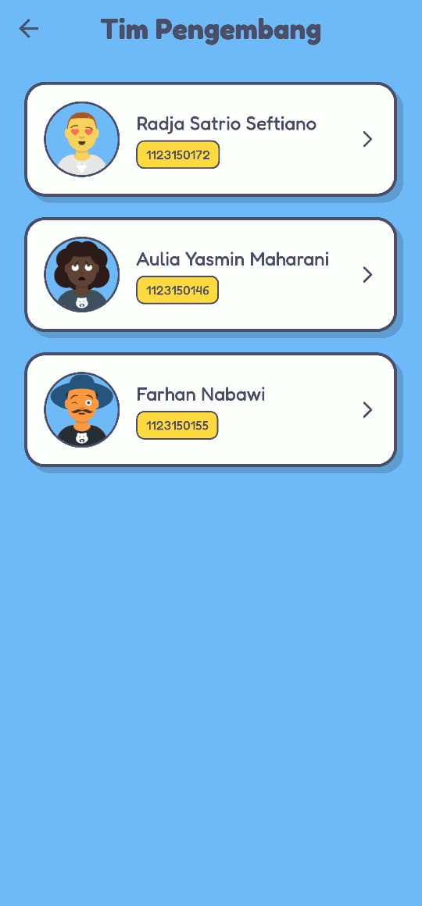 | 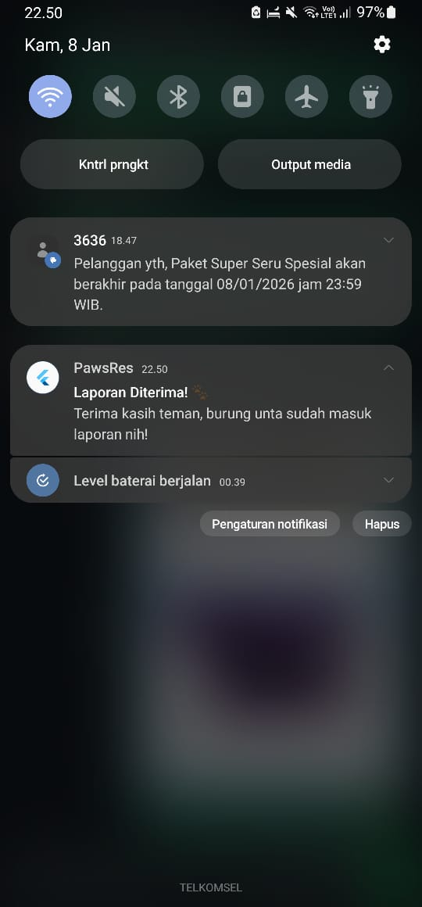 |

### 👥 The Developer Team

|                              Project Lead                              |                               Frontend Dev                               |                               Frontend Dev                               |
| :--------------------------------------------------------------------: | :----------------------------------------------------------------------: | :----------------------------------------------------------------------: |
| 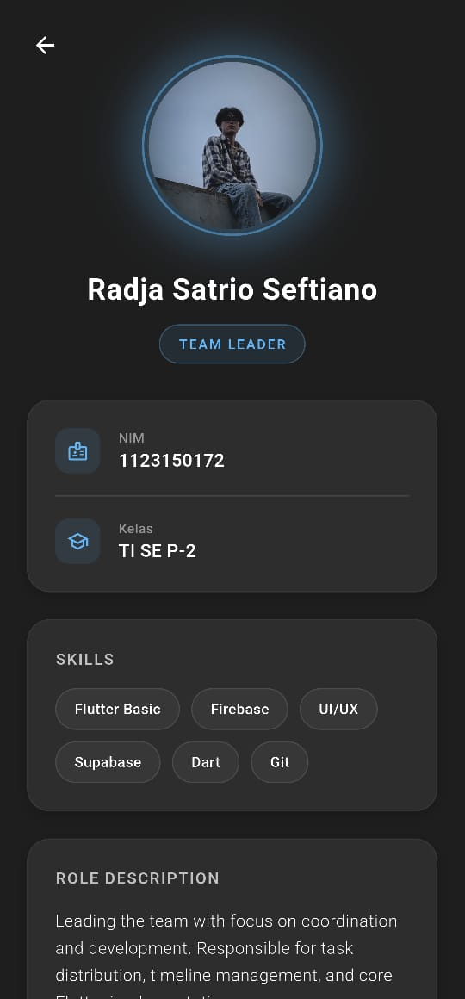<br>**Radja** | 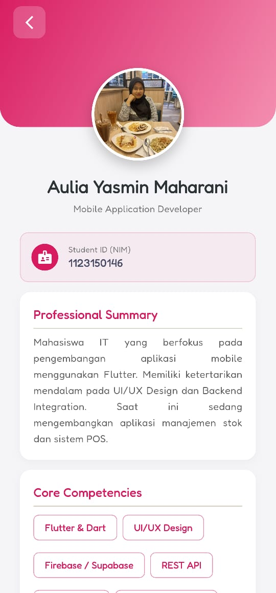<br>**Yasmin** | 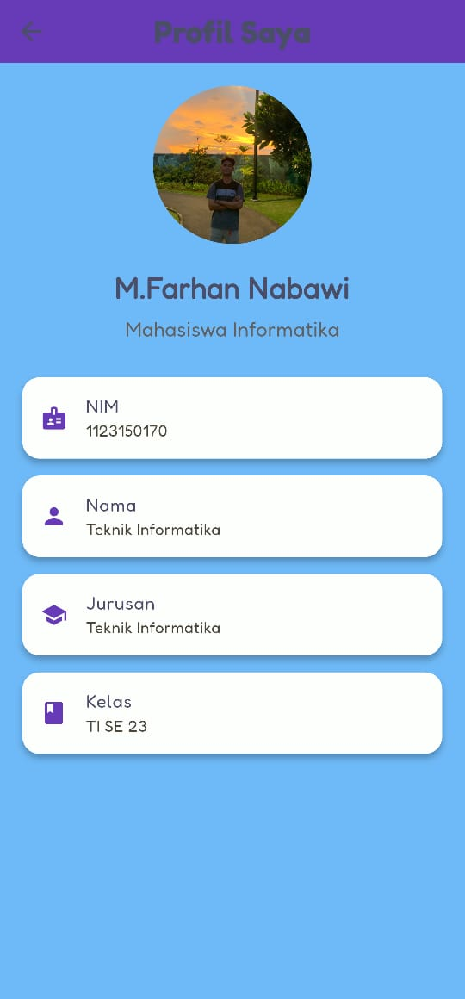<br>**Farhan** |

## Demo Video

Lihat video demo aplikasi kami untuk melihat semua fitur dalam aksi!

**[Watch Full Demo on YouTube](https://youtu.be/T5_1YrSuLI0?si=gYUsMfWzkEMnwcID)**

## Download APK

Download versi terbaru aplikasi Paw Res:

### Latest Release v1.0.0

- [**Download APK (103 MB)**](https://github.com/WhoIsR/Collab_MobileApp/releases/tag/V1.0.0)

**Minimum Requirements:**

- Android 6.0 (API level 23) or higher
- ~20MB free storage space

## Built With

- **[Flutter](https://flutter.dev/)** - UI Framework
- **[Dart](https://dart.dev/)** - Programming Language
- **[Firebase](https://firebase.google.com/)** - Backend & Authentication
- **[Supabase](https://supabase.com/)** - Local Database
- **[lottie files](https://lottiefiles.com/)** - Local Database

## Getting Started

### Prerequisites

Pastikan Anda sudah menginstall:

- Flutter SDK (3.16.0 or higher)
- Dart SDK (3.2.0 or higher)
- Android Studio / VS Code
- Git

### Installation

1. Clone repository

```bash
git clone https://github.com/WhoIsR/Collab_MobileApp
cd Collab_MobileApp
```

2. Install dependencies

```bash
flutter pub get
```

3. Setup Firebase

```bash
# Download google-services.json dari Firebase Console
# Place in android/app/
cp path/to/google-services.json android/app/
```

4. Run aplikasi

```bash
flutter run
```

### Build APK

```bash
# Debug APK
flutter build apk --debug

# Release APK
flutter build apk --release

# Split APK by ABI
flutter build apk --split-per-abi
```

## 📁 Project Structure

```text
lib/
├── core/
│   └── theme/
│       ├── app_colors.dart
│       └── app_theme.dart
├── data/
│   ├── models/
│   │   └── animal_report_model.dart
│   └── services/
│       ├── auth_service.dart
│       ├── fcm_v1_service.dart
│       ├── notification_service.dart
│       ├── report_service.dart
│       └── storage_service.dart
└── presentation/
    ├── pages/
    │   ├── auth/
    │   │   ├── login.dart
    │   │   └── register_page.dart
    │   ├── home/
    │   │   ├── add_report_page.dart
    │   │   ├── dashboard_page.dart
    │   │   ├── detail_page.dart
    │   │   ├── explore_page.dart
    │   │   └── my_activity_page.dart
    │   ├── profile/
    │   │   ├── profile-farhan.dart
    │   │   ├── profile-yasmin.dart
    │   │   ├── profile_detail_page.dart
    │   │   ├── profile_page.dart
    │   │   ├── profile_radja.dart
    │   │   └── profile_team_page.dart
    │   └── splashscreen/
    │       ├── splash_farhan.dart
    │       ├── splash_radja.dart
    │       └── splash_yasmin.dart
    ├── firebase_options.dart
    └── main.dart

## Authentication Flow

```

1. Splash Screen (Auto-login check)
   ↓
2. Login Screen / Register Screen
   ↓
3. Home Screen (Dashboard)
   ↓
4. Profile & Settings

````

## 🗄️ Database Schema

### Notes Table

```sql
CREATE TABLE public.animal_reports (
  id bigint GENERATED ALWAYS AS IDENTITY NOT NULL UNIQUE,
  api_name text NOT NULL,
  image_url text,
  location text NOT NULL,
  description text NOT NULL,
  contact_wa text NOT NULL,
  user_id text NOT NULL,
  created_at timestamp with time zone NOT NULL DEFAULT now(),
  CONSTRAINT animal_reports_pkey PRIMARY KEY (id)
);
````

## 📝 API Documentation

### Authentication Endpoints

- `POST /api/auth/register` - Register user baru
- `POST /api/auth/login` - Login user
- `POST /api/auth/logout` - Logout user
- `GET /api/auth/verify` - Verify token

### Development Workflow

1. Fork repository (atau Clone jika kalian kolaborator di satu repo yang sama)
2. Create feature branch (`git checkout -b feature/register`)
3. Commit changes (`git commit -m 'membuat Textfield'`)
4. Push to branch (`git push origin feature/register`)
5. Open Pull Request

## Team Members & Contributions

### Development Team

| Name                      | Role                       | Contributions                                                                               |
| :------------------------ | :------------------------- | :------------------------------------------------------------------------------------------ |
| **Radja Satrio Seftiano** | Project Lead & Backend Dev | • Authentication system<br>• Firebase integration<br>• API development<br>• Database design |
| **Aulia Yasmin Maharani** | Frontend Developer         | • UI/UX Design<br>• Login & Register logic<br>• Profile screen<br>• State management        |
| **Muhamad Farhan Nabawi** | Frontend Developer         | • Splash screen<br>• Register UI<br>• Notification system (FCM)<br>• Testing & Debugging    |

## 📄 License

This project is licensed under the MIT License - see the [LICENSE](LICENSE) file for details.

## Acknowledgments

- [Flutter Community](https://flutter.dev/community) - For amazing packages
- [Firebase](https://firebase.google.com/) - For backend services
- [Unsplash](https://unsplash.com/) - For placeholder images
- [Lottie Files](https://lottiefiles.com/) - For icons

---

<div align="center">
  <p>Made with by Berkelompok Team</p>
  <p>© 2026 Notes App. All rights reserved.</p>
</div>
